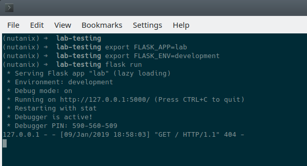

**************
Initialisation
**************

For this section we'll build the app based on the structure seen earlier.

Configuration Options
---------------------

`config.py` is where our app stores app-specific configuration.  For this basic application we are only storing a single static configuration item - the `SECRET_KEY` required for CSRF protection.  For more information on CSRF_, please see the CSRF_ Wikipedia article.

CSRF protection isn't strictly required for demo or isolated applications, but is a good habit to get into when developing web applications.

.. _CSRF: https://en.wikipedia.org/wiki/Cross-site_request_forgery

- Create `config.py`.  Please note that `config.py` should **not** be in the `lab/` folder.
- Add the following content to `config.py`:

.. code-block:: python

    import os

    class Config(object):
        SECRET_KEY = os.environ.get('SECRET_KEY') or 'some strong secret string'

We will import this key later to ensure our app is protected against CSRF.

Initialisation Script
---------------------

`lab/__init__.py` is our application's main initialisation script.  This file contains the application **factory** and instructs Python to treat our `lab` folder as a package.  In our app, configuration and setup, for example, will be carried out inside the factory function and the app returned afterwards.  For a more detailed explanation, please see the official factory tutorial_.

.. _tutorial: http://flask.pocoo.org/docs/1.0/tutorial/factory/

- Create a file named `__init__.py` in the `lab/` folder.
- For our application, the initial contents of `__init__.py` should be as follows:

.. code-block:: python

    import os

    from flask import Flask
    from flask_assets import Environment, Bundle

    from .util import apiclient
    from config import Config

    def create_app(test_config=None):
        # create and configure the app
        app = Flask(__name__, instance_relative_config=True)

        assets = Environment(app)

        app.config.from_object(Config)
        
        if test_config is None:
            # load the instance config, if it exists, when not testing
            app.config.from_pyfile('config.py', silent=True)
        else:
            # load the test config if passed in
            app.config.from_mapping(test_config)

        # ensure the instance folder exists
        try:
            os.makedirs(app.instance_path)
        except OSError:
            pass

        return app

Key lines to look for in `__init__.py`:

- `from flask import Flask` makes the Flask web framework available to our application.
- `from flask_assets import Environment, Bundle` enables us to store configuration and bring together our static files as **bundles**.
- `from .util import apiclient` and `from config import Config` imports our ApiClient package and grabs our configuration from `config.py`.
- `os.makedirs(app.instance_path)` attempts to create our instance path that can be used to store local data, e.g. files that won't be committed to source control.  We aren't explicitly using this folder in our app but it is a useful to know about.

At this point our application will actually "work".  It won't do anything particularly useful, although now is a good time to see how to run a Python Flask application.

Application first run
---------------------

Since we are developing a simple demo application, we only have two requirements to run our app.  Run these commands in the application's main folder i.e. **not** in the `lab/` folder.

1.  Tell Python Flask where to find our application.

.. figure:: ../images/linux_logo_32x32.png
.. figure:: ../images/osx_logo_32x32.png

.. code-block:: bash

    export FLASK_APP=lab

.. figure:: ../images/windows_logo_32x32.png

.. code-block:: bash

    set FLASK_APP=lab

2.  Tell Python Flask to run our app in development mode:

.. figure:: ../images/linux_logo_32x32.png
.. figure:: ../images/osx_logo_32x32.png

.. code-block:: bash

    export FLASK_ENV=development

.. figure:: ../images/windows_logo_32x32.png

.. code-block:: bash

    set FLASK_ENV=development

3.  Run the application:

.. figure:: ../images/linux_logo_32x32.png
.. figure:: ../images/osx_logo_32x32.png
.. figure:: ../images/windows_logo_32x32.png

.. code-block:: bash

    flask run

At this point, Python Flask tells us exactly what to do in order to test the beginnings of our application:

.. code-block:: bash

    * Running on http://127.0.0.1:5000/ (Press CTRL+C to quit)

- Browse to http://127.0.0.1:5000 on your local machine.  If everything is working, you'll get an HTTP 404 (Not Found) error.  At this point, that is completely expected but indicates that your environment is setup correctly and Flask is listening for HTTP requests on port 5000.

**Tip:** If you are developing this application and require access to it from outside your development system, the following command can be run to allow external access.  Instead of only listening on the localhost IP address (**127.0.0.1**), the Python Flask server will listen on your system's IP address.

.. figure:: ../images/linux_logo_32x32.png
.. figure:: ../images/osx_logo_32x32.png
.. figure:: ../images/windows_logo_32x32.png

.. code-block:: bash

    flask run --host:0.0.0.0

- Check the output in your console/terminal and you'll also see the 404 error reflected there, as expected:

This is a good test as it verifies everything is setup and working.  It also verifies that the dependencies are installed, along with Python Flask being ready to serve your application.

Now let's start building our application by adding the application's supporting files.