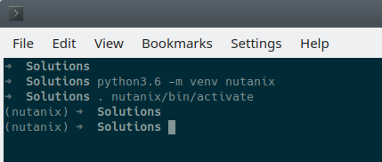
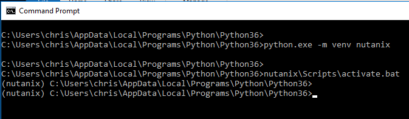
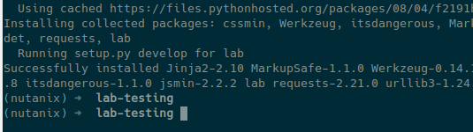

*****
Setup
*****

Project Location
----------------

You can store your project files anywhere you like.  For our lab, to keep things consistent, we will use a folder named `python-lab`.

- Create a folder named `python-lab`, making sure you have write permissions to that folder.  If you are using the command line, some examples for creating the folder are as follows:

.. figure:: ../images/linux_logo_32x32.png
.. figure:: ../images/osx_logo_32x32.png

.. code-block:: bash

    cd ~
    mkdir python-lab
    cd python-lab

.. figure:: ../images/windows_logo_32x32.png

.. code-block:: bash

    cd %HOMEPATH%
    mkdir python-lab
    cd python-lab

Please ensure you have a command prompt open and have changed to the above directory before continuing.

Virtual Environments
--------------------

It is recommended that your Python development is done inside a Python virtual environment.  Developing in a virtual environment can help replicate and test things like Python setup scripts and ensure all dependencies are met before running a Python script or application.

Even though virtual environments (venv) are now included with Python 3, we'll use the following command to make sure they work.  Please run these commands from the directory your project will be stored in.

.. figure:: ../images/linux_logo_32x32.png
.. figure:: ../images/osx_logo_32x32.png

.. code-block:: bash

    python3.6 -m venv nutanix
    . nutanix/bin/activate

.. figure:: ../images/windows_logo_32x32.png

.. code-block:: bash

    python.exe -m venv nutanix
    nutanix\Scripts\activate.bat

**Note re Windows systems:** As at January 2019, a **default** installation of Python 3.6 will be installed in the following folder:

.. code-block:: bash

    C:\Users\<username>\AppData\Local\Programs\Python\Python36

Running these commands to setup and activate a new virtual environment will look similar to the following screenshot.  Note the `(nutanix)` designation that indicates we are now developing inside the new virtual environment.

If you need to leave the virtual environment, use the following command:

.. figure:: ../images/linux_logo_32x32.png
.. figure:: ../images/osx_logo_32x32.png

.. code-block:: bash

    deactivate

.. figure:: ../images/windows_logo_32x32.png

.. code-block:: bash

    nutanix\Scripts\deactivate.bat

**Additional note re Windows:** Even though the commands above run .bat files, PowerShell .ps1 scripts are included, too.  If you prefer to use PowerShell, replace `activate.bat` with `Activate.ps1`.  To deactivate, simply enter `deactivate`.  There is no `Deactivate.ps1` as a script is created in memory for this purpose.

If you wish to delete the virtual environment at any stage, simply delete the `nutanix` virtual environment directory and all its contents.

For more information on virtual environments, please see the official Python virtual environment documentation_.

.. _documentation: https://docs.python.org/3/tutorial/venv.html

App Dependencies
----------------

Our application will require additional Python modules beyond those that are included in the Python Standard Library_.

.. _Library: https://docs.python.org/3.6/library/

The easiest way to ensure these are available is by using a Python Setup Script.  In our case, the setup script is quite basic and simply installs any dependencies we don't already have available.

- Firstly, make sure you have created and activated a virtual environment, as outlined above.  For this lab, your virtual environment should be called `nutanix`.
- Create a script in the project folder named `setup.py`.  This setup script will handle the installation of dependencies required for this Python Flask application:

.. code-block:: python

    from setuptools import find_packages, setup

    setup(
            name='lab',
            version='1.0.0',
            packages=find_packages(),
            include_package_data=True,
            zip_safe=False,
            install_requires=[
                'flask',
                'flask_assets',
                'jsmin',
                'cssmin',
                'requests',
                'wtforms',
                'flask-wtf'
            ],
    )

- The final file to create at this stage will allow us to make the app `installable`.  This file is called `MANIFEST.in` and describes the other files that are to be included during installation.  We haven't created some of these files, yet, but that's OK for now.

- Create a file in the project folder named `MANIFEST.in` and add the following contents:

.. code-block:: bash

    graft lab/static
    graft lab/templates
    global-exclude *.pyc

- Now, to ensure our dependencies are installed and available, run the `setup.py` script as follows.

**Note:** The trailing period (`.`) is required.

.. figure:: ../images/linux_logo_32x32.png
.. figure:: ../images/osx_logo_32x32.png

.. code-block:: bash

    pip3 install -e .

.. figure:: ../images/windows_logo_32x32.png

.. code-block:: bash

    <python_install_folder>\Scripts\pip3.6.exe install -e .
    
- If all dependencies have been found and installed correctly, the end of the output will look something like this.  Note that if you are installing packages you don't have, the messages re installing from cache may be slightly different.

With our environment now setup to run our Python Flask application, we can move on to creating the application itself.