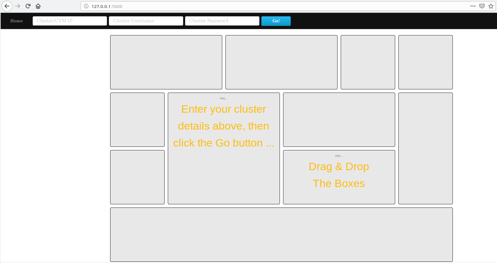
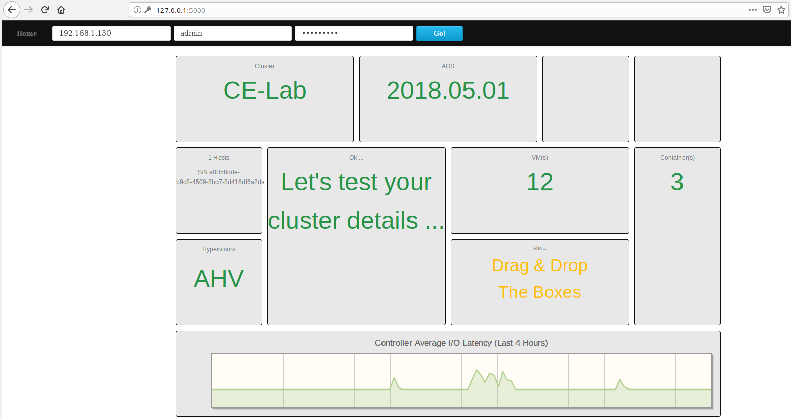

***************
Testing The App
***************

With our JavaScript, AJAX, CSS, views and templates now in place, it's a good time to run our application and see what happens.

If you don't currently have your virtual environment activated or if the application isn't running, these are the steps to do so.  Make sure you are in the application's directory before running these commands.

.. figure:: ../images/linux_logo_32x32.png

.. code-block:: bash

    export FLASK_APP=lab
    export FLASK_ENV=development
    . nutanix/bin/activate
    flask run

.. figure:: ../images/windows_logo_32x32.png

.. code-block:: bash

    set FLASK_APP=lab
    set FLASK_ENV=development
    nutanix\Scripts\activate.bat
    flask run

- Browse to http://127.0.0.1:5000 to view your application.  If everything is setup correctly, you will see a basic HTML form prompting for a **Cluster/CVM IP**, your **Cluster Username** and **Cluster Password**.  You'll also see a number of styled and labelled "containers", ready for our cluster info to be displayed.

- In our lab environment, enter the CVM/Cluster IP address as provided by your presenter.
- Enter your cluster username.
- Enter your cluster password.
- Click the `Go!` button.

If everything has been created and all parts of the application wired up correctly, the application will carry out our API requests via AJAX, process the results and display it all nicely on our page.

A successful test run will look similar to the screenshot below, although your cluster details will be different.

